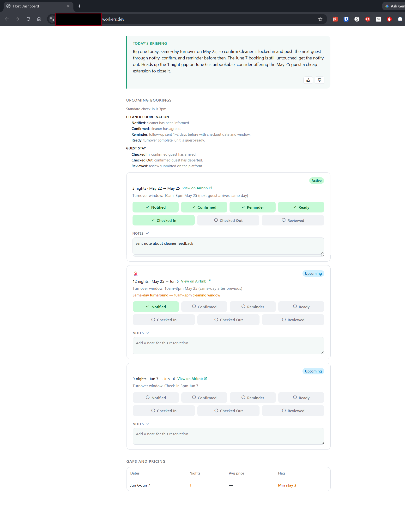

# str-assistant-dashboard

A daily-briefing dashboard for self-managed short-term rental hosts. One URL per property, one question answered: what needs my attention today?

## What it does

Replaces a host's daily cross-referencing across Airbnb, their calendar, and their own head with one URL. Each morning the dashboard shows the bookings closest to action, flags unbookable gaps where revenue is quietly leaking, hands over a Claude-written summary of what needs attention, and tracks cleaner coordination. Host and co-host reach the same view via the same secret URL — no syncing of notes, no comparing spreadsheets.

The pieces, briefly: bookings come from a Google Calendar iCal feed. Gaps are flagged against the minimum stay set in `config/property.json` — PriceLabs integration is on the v2 roadmap, so v1 reads min-stay from config rather than introducing an external pricing dependency to ship the gaps feature. The briefing is generated by Claude. Coordination state lives in Supabase.



**Live demo:** **[str-host-dashboard-demo.dh-str.workers.dev](https://str-host-dashboard-demo.dh-str.workers.dev)** — the real codebase running on dummy data (no guest PII), showcasing every feature: a same-day-turnaround alert, the cleaner/guest checklists, flagged revenue-leak gaps, and the Claude-written briefing. The production instance runs the same code with live data behind a private, unpublished URL (in v1 the URL itself is the access credential).

## Current state

🎉 **v1 shipped (2026-05-22).** A host and co-host open one secret URL and, in a 60-second glance, know what needs attention today — the daily Claude briefing, the upcoming bookings closest to action, flagged revenue-leak gaps, and cleaner coordination — live on Cloudflare Workers. See [ROADMAP.md](./ROADMAP.md) for what's next (v2: PriceLabs pricing, inventory + recurring maintenance, history view, and more).

## How development is run

This project is built under the **4D framework**: Delegation, Description, Discernment, Diligence. In practice the framework shows up in three places in the repo:

- [CLAUDE.md](./CLAUDE.md) — architectural rules that any change has to respect: config-as-data, pure engine functions, isolated I/O at the boundaries, styling conventions, and a working-style rule for AI-assisted edits.
- [ROADMAP.md](./ROADMAP.md) — task list with explicit prerequisites and a **Decision log** section that records architectural choices when they resolve a real fork in the road (not as routine documentation).
- A `/dailytask` skill in my Claude Code setup operationalizes Discernment and Diligence — selecting the next task given priorities and prerequisites, then executing it with quality controls.

## Architecture

Config-driven engine, pure functions, I/O isolated at the boundaries. See [CLAUDE.md](./CLAUDE.md) for the full contract.

```
config/property.json            ← property name, cleaner name, minimum stay
config/briefing-rules.json      ← briefing behavior (thresholds, tone, custom rules)
.env                            ← credentials (ICAL_URL, SUPABASE_*, ANTHROPIC_API_KEY, PROPERTY_ID)
src/config/                     ← typed loaders that validate config/*.json and read env lazily
src/engine/                     ← pure functions: parse calendar, compute gaps, build prompt
src/api/                        ← external API calls (Claude, iCal feed)
src/db/supabase.ts              ← reads/writes for checklists, briefings, feedback, booking notes
src/server/                     ← server-side routes
src/client/                     ← React components (inline styles + CSS variables, no CSS framework)
src/demo/fixtures.ts            ← static demo data served when DEMO_MODE=true (no secrets needed)
```

Stack: TanStack Start (React + SSR on Cloudflare Workers), Supabase (Postgres + RLS), Vite, TypeScript end-to-end.

## Local setup

1. Clone and install:
   ```
   git clone https://github.com/dhoovDB/str-assistant-dashboard
   cd str-assistant-dashboard
   npm install
   ```
2. Create a Supabase project, then run [`supabase/schema.sql`](./supabase/schema.sql) in the Supabase SQL editor to create the four tables (`checklist_state`, `briefings`, `briefing_feedback`, `booking_notes`) with permissive RLS. The schema rationale lives in [ROADMAP Task 2](./ROADMAP.md#task-2-supabase-and-property-config-setup-1-hour) and the [decision log entry on RLS](./ROADMAP.md#decision-log).
3. Copy `.env.example` to `.env` and fill in `SUPABASE_URL`, `SUPABASE_KEY`, `PROPERTY_ID` (any non-empty string — used as the key for this property's rows in Supabase), `ICAL_URL` (an Airbnb host export URL or any iCal feed), and `ANTHROPIC_API_KEY`. The iCal URL is a credential and stays in `.env` — never in `config/property.json` (see [decision log 2026-05-16](./ROADMAP.md#2026-05-16--ical-url-moved-to-env-minstay-validation-added)).
4. Edit `config/property.json` with your property name, cleaner name, and minimum stay.
5. `npm run dev` — the config validator refuses to start if `config/property.json` is invalid.

## Deploy (Cloudflare Workers)

The app ships as a single Cloudflare Worker — SSR, server functions, and static assets in one deployment. Vite produces the build; `wrangler` deploys it.

First-time setup:

1. `npx wrangler login` — authenticate with your Cloudflare account.
2. Set production secrets. These are **not** read from `.env` in production — Cloudflare injects them into the Worker runtime, where `nodejs_compat` exposes them on `process.env`:
   ```
   npx wrangler secret put SUPABASE_URL
   npx wrangler secret put SUPABASE_KEY
   npx wrangler secret put ICAL_URL
   npx wrangler secret put ANTHROPIC_API_KEY
   npx wrangler secret put PROPERTY_ID
   ```
3. Set the worker `name` in `wrangler.jsonc`, and pick a `workers.dev` subdomain when prompted on first deploy.

Deploy (and every redeploy):
```
npm run deploy
```
This runs `vite build` then `wrangler deploy -c dist/server/wrangler.json`. The generated `dist/server/wrangler.json` points at the built worker entry; the root `wrangler.jsonc` `main` is the pre-build source the Vite plugin reads, so it isn't the deploy target (see [decision log 2026-05-22](./ROADMAP.md#decision-log)).

The deployed URL — `https://<worker-name>.<subdomain>.workers.dev` — is itself the access credential. v1 has no login: security comes from URL secrecy + permissive RLS. For that reason the live URL is shared privately and is **not** committed to this repo.
